<div align="center">

# ☕ Java DSA – NMIMS


-red?style=for-the-badge)


### 🚀 *Master Data Structures & Algorithms with Java!*

**Welcome to your comprehensive DSA learning journey!**  
Everything you need to ace coding interviews and become a problem-solving expert.

[📚 Start Learning](#-topics-covered) • [💻 Problems Solved](#-problems-covered---day-1) • [🎯 What's Next](#-whats-coming-next)

---

</div>

## 🎯 Quick Navigation

<table>
<tr>
<td width="33%" align="center">

### 📦 **Collections**
Arrays, ArrayList, Lists

[Jump to Topics →](#-collections-framework)

</td>
<td width="33%" align="center">

### 🔢 **Arrays**
Manipulation & Problem Solving

[View Algorithms →](#-arrays--arraylist)

</td>
<td width="33%" align="center">

### 🏆 **Problems**
Practice Questions

[See Problems →](#-problems-covered---day-1)

</td>
</tr>
</table>

---

## 📊 Learning Progress

```
Day 1 - Collections & Arrays:
████████████████████████████████ 100%

✅ Arrays - Basics & Manipulation
✅ ArrayList - Dynamic Arrays
✅ Collections Framework Overview
✅ Lists - ArrayList, LinkedList
✅ Move Zeroes to End Problem
✅ Remove Duplicates Problem
✅ Practice Problems

Day 2 - Interfaces: Set & Map:
████████████████████████████████ 100%

✅ Set Interface (HashSet, LinkedHashSet, TreeSet)
✅ Iterator & Iteration Patterns
✅ Check Duplicates Using Sets
✅ Map Interface (HashMap, TreeMap, LinkedHashMap)
✅ HashMap Operations & Methods
✅ Entry Set Iteration
✅ Frequency Counting Problems

Day 3 - Advanced Techniques & Queue:
🔜 IN PROGRESS

⏳ Queue Interface (PriorityQueue, Deque)
⏳ Two Pointers Technique
⏳ Sliding Window Technique
⏳ Prefix Sum Algorithm
⏳ Recursion Basics
⏳ Problem Solving & Practice
```

---

## 🗺️ Learning Path

```mermaid
graph LR
    A[📦 Arrays] --> B[📋 ArrayList]
    B --> C[🎯 Collections]
    C --> D[📚 Lists]
    D --> E[🗺️ Set]
    E --> F[🗺️ Map]
    F --> G[📬 Queue]
    G --> H[🪟 Sliding Window]
    H --> I[➕ Prefix Sum]
    I --> J[🔥 Problem Solving]
    
    style A fill:#90EE90
    style B fill:#90EE90
    style C fill:#90EE90
    style D fill:#90EE90
    style E fill:#90EE90
    style F fill:#90EE90
    style G fill:#FFD700
    style H fill:#87CEEB
    style I fill:#87CEEB
    style J fill:#FF6B6B
```



---

## 📚 Topics Covered

<details open>
<summary><h3>📦 Arrays & ArrayList</h3></summary>

> **Array:** Fixed-size collection of elements of the same type stored in contiguous memory locations.
> **ArrayList:** Dynamic array that grows automatically when needed.

### 1️⃣ **Arrays Basics**

#### 📊 Array Declaration & Initialization

```java
// Declaration
int[] arr;
int arr2[];
int[] arr3 = new int[5];

// Initialization with values
int[] numbers = {1, 2, 3, 4, 5};
String[] fruits = {"Apple", "Banana", "Mango"};

// Multi-dimensional arrays
int[][] matrix = {{1, 2, 3}, {4, 5, 6}};

// Getting array size
int length = numbers.length;  // 5

// Accessing elements (0-indexed)
int first = numbers[0];   // 1
int last = numbers[4];    // 5
```

#### ⏱️ Time & Space Complexity

| Operation | Time | Space |
|:----------|:----:|:-----:|
| Access | O(1) | O(n) |
| Search | O(n) | — |
| Insert | O(n) | — |
| Delete | O(n) | — |

#### 🔧 Array Traversal Methods

```java
// Enhanced for loop
int[] arr = {10, 20, 30, 40, 50};

for (int val : arr) {
    System.out.println(val);
}

// Traditional for loop
for (int i = 0; i < arr.length; i++) {
    System.out.println(arr[i]);
}

// While loop
int i = 0;
while (i < arr.length) {
    System.out.println(arr[i]);
    i++;
}
```

---

### 2️⃣ **ArrayList - Complete Guide**

> **ArrayList** is a resizable implementation of the List interface, part of the Collections Framework.

#### 📦 ArrayList Declaration & Creation

```java
// Basic declaration
ArrayList<Integer> list = new ArrayList<>();

// With initial capacity
ArrayList<Integer> list2 = new ArrayList<>(10);

// Different data types
ArrayList<String> names = new ArrayList<>();
ArrayList<Double> prices = new ArrayList<>();
ArrayList<Boolean> flags = new ArrayList<>();
```

#### ⚙️ ArrayList Operations

```java
ArrayList<Integer> numbers = new ArrayList<>();

// ADD - Insert elements at end | O(1) amortized
numbers.add(10);
numbers.add(20);
numbers.add(30);
// Output: [10, 20, 30]

// ADD AT INDEX - Insert at specific position | O(n)
numbers.add(1, 15);  // Insert 15 at index 1
// Output: [10, 15, 20, 30]

// GET - Retrieve element by index | O(1)
int element = numbers.get(2);  // 20

// SET - Modify element at index | O(1)
numbers.set(0, 5);
// Output: [5, 15, 20, 30]

// REMOVE - Delete element by index | O(n)
numbers.remove(2);
// Output: [5, 15, 30]

// REMOVE by value | O(n)
numbers.remove(Integer.valueOf(15));
// Output: [5, 30]

// SIZE - Get total elements | O(1)
int size = numbers.size();  // 2

// CHECK IF EMPTY | O(1)
boolean isEmpty = numbers.isEmpty();

// CONTAINS - Check if element exists | O(n)
boolean has10 = numbers.contains(10);  // true

// CLEAR - Remove all elements | O(n)
// numbers.clear();
```

#### 📊 Complete ArrayList Example

```java
public class ArrayListDemo {
    public static void main(String[] args) {
        ArrayList<Integer> numbers = new ArrayList<>();
        
        // Adding elements
        numbers.add(10);
        numbers.add(20);
        numbers.add(30);
        System.out.println("After adding: " + numbers);
        // Output: After adding: [10, 20, 30]
        
        // Adding at index
        numbers.add(1, 15);
        System.out.println("After adding at index 1: " + numbers);
        // Output: After adding at index 1: [10, 15, 20, 30]
        
        // Getting element
        System.out.println("Element at index 2: " + numbers.get(2));
        // Output: Element at index 2: 20
        
        // Setting element
        numbers.set(0, 5);
        System.out.println("After setting index 0: " + numbers);
        // Output: After setting index 0: [5, 15, 20, 30]
        
        // Removing element
        numbers.remove(2);
        System.out.println("After removing index 2: " + numbers);
        // Output: After removing index 2: [5, 15, 30]
        
        // Size and isEmpty
        System.out.println("Size: " + numbers.size());
        System.out.println("Is empty: " + numbers.isEmpty());
        // Output: Size: 3, Is empty: false
    }
}
```

---

### 3️⃣ **ArrayList vs Array**

| Feature | Array | ArrayList |
|:--------|:-----:|:---------:|
| **Size** | Fixed | Dynamic |
| **Type** | Primitive/Object | Object only |
| **Performance** | Faster (fixed size) | Slower (resizable) |
| **Memory** | Exact | Extra buffer |
| **Type Safety** | Weak | Type-safe with Generics |
| **Flexibility** | Low | High |
| **Access** | O(1) | O(1) |
| **Insert/Delete** | O(n) | O(n) |

#### 📈 When to Use What?

**Use Array when:**
- ✅ Fixed size known in advance
- ✅ Maximum performance needed
- ✅ Working with primitives
- ✅ Memory is critical

**Use ArrayList when:**
- ✅ Size changes frequently
- ✅ Code flexibility needed
- ✅ Need dynamic growth
- ✅ Convenience > Performance

</details>

---

<details open>
<summary><h3>🎯 Collections Framework</h3></summary>

> **Collections Framework** provides unified architecture for representing and manipulating collections efficiently.

### 📊 Collections Hierarchy

```
Iterable (Interface)
    ↓
Collection (Interface)
    ├── List (Interface)
    │   ├── ArrayList ← Most used
    │   ├── LinkedList
    │   └── Vector (Legacy)
    ├── Set (Interface)
    │   ├── HashSet
    │   ├── LinkedHashSet
    │   ├── TreeSet
    │   └── EnumSet
    └── Queue (Interface)
        ├── PriorityQueue
        ├── Deque
        └── LinkedList (dual-purpose)

Map (Separate Interface)
    ├── HashMap ← Most used
    ├── LinkedHashMap
    ├── TreeMap
    ├── Hashtable (Legacy)
    └── WeakHashMap
```

---

</details>

<details open>
<summary><h3>📚 Lists Collection</h3></summary>

> **List** is an ordered collection that allows duplicates and index-based access.

### 1️⃣ **ArrayList** - Already Covered Above ✅

---

### 2️⃣ **LinkedList** - Linked Structure

```java
import java.util.LinkedList;

public class LinkedListDemo {
    public static void main(String[] args) {
        LinkedList<String> list = new LinkedList<>();
        
        // ADD operations
        list.add("Java");
        list.add("Python");
        list.add("C++");
        System.out.println("After add: " + list);
        // Output: [Java, Python, C++]
        
        // ADD at specific index
        list.add(1, "JavaScript");
        System.out.println("After add at index 1: " + list);
        // Output: [Java, JavaScript, Python, C++]
        
        // FIRST and LAST elements
        System.out.println("First: " + list.getFirst());  // Java
        System.out.println("Last: " + list.getLast());    // C++
        
        // REMOVE operations
        list.removeFirst();  // Remove Java
        list.removeLast();   // Remove C++
        System.out.println("After removals: " + list);
        // Output: [JavaScript, Python]
        
        // ADD operations (queue-style)
        list.addFirst("HTML");
        list.addLast("SQL");
        System.out.println("After queue operations: " + list);
        // Output: [HTML, JavaScript, Python, SQL]
    }
}
```

**Characteristics:**
- ✅ Allows duplicates
- ✅ Maintains insertion order
- ✅ Linked structure (nodes with pointers)
- ✅ O(n) random access, O(1) add/remove at ends
- ✅ More memory (pointers) per element

---

### 📊 ArrayList vs LinkedList

| Operation | ArrayList | LinkedList |
|:----------|:---------:|:----------:|
| **Access (get)** | O(1) | O(n) |
| **Add (end)** | O(1) amortized | O(1) |
| **Add (middle)** | O(n) | O(n) |
| **Remove** | O(n) | O(n) |
| **Memory** | Less | More (pointers) |
| **Cache** | Better | Worse |
| **Best For** | Search | Queue/Stack |

</details>

---

<details open>
<summary><h3>💾 Array Problem Solving - Move Zeroes</h3></summary>

> **Problem:** Move all zeros to the end of the array while maintaining the relative order of non-zero elements.

### 🎯 Approach: Two Pointers

The two-pointer technique uses one pointer to mark the position for the next non-zero element.

#### 🔧 Implementation

```java
public class MoveZeroes {
    public static void main(String[] args) {
        int[] arr = {0, 4, 0, 9};
        
        moveZeroes(arr);
        
        // Print result
        for (int val : arr) {
            System.out.print(val + " ");
        }
        // Output: 4 9 0 0
    }
    
    public static void moveZeroes(int[] arr) {
        /*
        Two-pointer approach:
        - j tracks position for next non-zero element
        - i traverses the entire array
        - When we find non-zero, swap with position j
        
        Time Complexity: O(n) - single pass
        Space Complexity: O(1) - in-place operation
        */
        
        int j = 0;  // Position for next non-zero element
        
        for (int i = 0; i < arr.length; i++) {
            if (arr[i] != 0) {
                // Found a non-zero element
                // Swap it to position j
                int temp = arr[i];
                arr[i] = arr[j];
                arr[j] = temp;
                j++;
            }
        }
    }
}
```

#### 🎯 Dry Run Example: `{0, 4, 0, 9}`

```
Initial: arr = [0, 4, 0, 9], j = 0

i=0: arr[0]=0 → Skip (is zero)

i=1: arr[1]=4 → Not zero
     Swap arr[1] and arr[0]
     arr = [4, 0, 0, 9]
     j = 1

i=2: arr[2]=0 → Skip (is zero)

i=3: arr[3]=9 → Not zero
     Swap arr[3] and arr[1]
     arr = [4, 9, 0, 0]
     j = 2

Final Result: [4, 9, 0, 0] ✅
```

#### 📊 Visualization

```
Step 1: [0, 4, 0, 9]  (j=0, i=0: skip zero)
        ↑
        j
        
Step 2: [4, 0, 0, 9]  (i=1: found 4, swap)
           ↑
           j
           
Step 3: [4, 0, 0, 9]  (j=1, i=2: skip zero)
           ↑
           j
           
Step 4: [4, 9, 0, 0]  (i=3: found 9, swap)
              ↑
              j
              
Final: [4, 9, 0, 0] ✅
```

#### ⏱️ Complexity Analysis

- **Time Complexity:** O(n)
  - Single pass through array
  - Each element visited once
  
- **Space Complexity:** O(1)
  - No extra space used
  - In-place swapping
  
- **Why this works:**
  - When arr[i] ≠ 0, we move it forward
  - Position j always marks the next available spot for non-zero
  - By the end, all non-zeros are before all zeros

#### 🔄 More Examples

```java
// Example 1: All zeros
Input: [0, 0, 0]
Output: [0, 0, 0]

// Example 2: No zeros
Input: [1, 2, 3]
Output: [1, 2, 3]

// Example 3: Mixed
Input: [0, 1, 0, 3, 12]
Output: [1, 3, 12, 0, 0]

// Example 4: Zeros at end
Input: [1, 2, 3, 0, 0]
Output: [1, 2, 3, 0, 0]
```

</details>

---

<details open>
<summary><h3>💾 Removing Duplicates - Complete Solution</h3></summary>

> **Problem:** Remove all duplicate elements from an ArrayList while preserving elements.

### ❌ Approach 1: Brute Force (O(n²))

```java
public class RemoveDuplicatesBruteForce {
    public static void main(String[] args) {
        ArrayList<Integer> arr = new ArrayList<>();
        int[] input = {1, 4, 1, 1, 1, 1, 1, 4, 3, 133, 345, 13, 13};
        
        for (int val : input) {
            arr.add(val);
        }
        
        // Compare each element with all elements after it
        for (int i = 0; i < arr.size(); i++) {
            for (int j = i + 1; j < arr.size(); j++) {
                // If duplicate found, remove it
                if (arr.get(i).equals(arr.get(j))) {
                    arr.remove(j);
                    j--;  // Adjust index after removal
                }
            }
        }
        
        System.out.println("Result: " + arr);
        // Output: [1, 4, 3, 133, 345, 13]
    }
}
```

**Dry Run Example:**

```
Initial: [1, 4, 1, 1, 1, 1, 1, 4, 3, 133, 345, 13, 13]
         
i=0 (val=1): j=2 finds duplicate 1 → remove
             [1, 4, 1, 1, 1, 1, 4, 3, 133, 345, 13, 13]
             j=2 finds duplicate 1 → remove
             [1, 4, 1, 1, 1, 4, 3, 133, 345, 13, 13]
             ... continue until no more 1s at end

i=1 (val=4): j=6 finds duplicate 4 → remove
             [1, 4, 1, 1, 1, 3, 133, 345, 13, 13]

... continue for all elements

Final: [1, 4, 3, 133, 345, 13]
```

**Complexity Analysis:**
- ⏱️ **Time:** O(n²) - nested loops
- 💾 **Space:** O(1) - no extra space
- ✅ **Pros:** Simple, in-place
- ❌ **Cons:** Slow for large lists

---

### ⚡ Approach 2: Using HashSet Constructor (O(n))

```java
public class RemoveDuplicatesHashSet {
    public static void main(String[] args) {
        ArrayList<Integer> arr = new ArrayList<>();
        int[] input = {1, 4, 1, 1, 1, 1, 1, 4, 3, 133, 345, 13, 13};
        
        for (int val : input) {
            arr.add(val);
        }
        
        // Convert ArrayList to HashSet and back
        // HashSet automatically removes duplicates
        ArrayList<Integer> result = new ArrayList<>(new HashSet<>(arr));
        
        System.out.println("Result: " + result);
        // Output: [1, 4, 3, 133, 345, 13]
    }
}
```

**How it works:**
```
1. new HashSet<>(arr)      → Converts ArrayList to HashSet
                             → Automatically removes duplicates
                             
2. new ArrayList<>(...)     → Converts back to ArrayList
```

**Complexity Analysis:**
- ⏱️ **Time:** O(n)
- 💾 **Space:** O(n)
- ✅ **Pros:** Concise, fast
- ❌ **Cons:** Order not guaranteed, extra space

---

### 🎯 Complete Solution Comparison

```java
import java.util.*;

public class RemoveDuplicates {
    
    // Method 1: Brute Force (O(n²) time, O(1) space)
    public static ArrayList<Integer> removeDuplicatesBruteForce(int[] input) {
        ArrayList<Integer> arr = new ArrayList<>();
        for (int val : input) arr.add(val);
        
        for (int i = 0; i < arr.size(); i++) {
            for (int j = i + 1; j < arr.size(); j++) {
                if (arr.get(i).equals(arr.get(j))) {
                    arr.remove(j);
                    j--;
                }
            }
        }
        return arr;
    }
    
    // Method 2: Using HashSet Constructor (O(n) time, O(n) space) - RECOMMENDED
    public static ArrayList<Integer> removeDuplicatesHashSet(int[] input) {
        ArrayList<Integer> arr = new ArrayList<>();
        for (int val : input) arr.add(val);
        
        return new ArrayList<>(new HashSet<>(arr));
    }
    
    public static void main(String[] args) {
        int[] input = {1, 4, 1, 1, 1, 1, 1, 4, 3, 133, 345, 13, 13};
        
        System.out.println("Original: " + Arrays.toString(input));
        System.out.println("Brute Force: " + removeDuplicatesBruteForce(input));
        System.out.println("HashSet: " + removeDuplicatesHashSet(input));
        
        // Output:
        // Original: [1, 4, 1, 1, 1, 1, 1, 4, 3, 133, 345, 13, 13]
        // Brute Force: [1, 4, 3, 133, 345, 13]
        // HashSet: [1, 4, 3, 133, 345, 13]
    }
}
```

#### 📊 Approach Comparison

| Aspect | Brute Force | HashSet |
|:-------|:-----------:|:-------:|
| **Time** | O(n²) | O(n) |
| **Space** | O(1) | O(n) |
| **Speed** | Slow | Fast ⭐ |
| **Order Preserved** | ✅ Yes | ❌ No |
| **Code Simplicity** | Simple | Simpler ⭐ |
| **Use Case** | Learning | Production |

</details>

---

## ✅ Problems Covered - Day 1

### 📋 **Collections & Arrays**

| # | Problem | Difficulty | Concept | Status |
|:-:|:--------|:----------:|:--------|:------:|
| 1 | Array Input/Output | 🟢 Easy | Array Basics | ✅ |
| 2 | ArrayList Operations | 🟢 Easy | ArrayList Methods | ✅ |
| 3 | Move Zeroes to End | 🟡 Medium | Two Pointers | ✅ |
| 4 | Remove Duplicates (Brute Force) | 🟡 Medium | Nested Loops | ✅ |
| 5 | Remove Duplicates (HashSet) | 🟡 Medium | Collections | ✅ |
| 6 | ArrayList Iteration Methods | 🟢 Easy | Collections | ✅ |

---

## ✅ Problems Covered - Day 2

### 📋 **Set & Map Interfaces**

| # | Problem | Difficulty | Concept | Status |
|:-:|:--------|:----------:|:--------|:------:|
| 1 | Set Interface Basics | 🟢 Easy | HashSet, LinkedHashSet, TreeSet | ✅ |
| 2 | Iterator Pattern | 🟢 Easy | Iterator, hasNext(), next() | ✅ |
| 3 | Check Duplicates Method 1 | 🟡 Medium | Set Size Comparison | ✅ |
| 4 | Check Duplicates Method 2 | 🟡 Medium | Set + List Combination | ✅ |
| 5 | HashMap Basic Operations | 🟡 Medium | put(), get(), containsKey() | ✅ |
| 6 | HashMap Frequency Counting | 🟡 Medium | Frequency Map Pattern | ✅ |
| 7 | Entry Set Iteration | 🟡 Medium | Map.Entry, entrySet() | ✅ |

---

## 📚 Topics Covered - Day 2

<details open>
<summary><h3>📦 Set Interface - Complete Guide</h3></summary>

> **Set** is a collection that contains no duplicate elements. It models the mathematical set abstraction.

### Set Hierarchy

```
Collection (Interface)
    └── Set (Interface)
        ├── HashSet ← Most used, unordered
        ├── LinkedHashSet ← Insertion order
        └── TreeSet ← Sorted order
```

---

### 1️⃣ **HashSet - Unordered Unique Elements**

> **HashSet** stores unique elements in no particular order using hash table internally.

#### 🔧 Basic Operations

```java
import java.util.*;

public class HashSetDemo {
    public static void main(String[] args) {
        Set<Integer> set = new HashSet<>();
        
        // ADD - Insert element | O(1) average
        set.add(43);
        set.add(51);
        set.add(12);
        set.add(99);
        set.add(51);  // Duplicate - will be ignored
        
        System.out.println("Set: " + set);
        // Output: [12, 43, 51, 99] (order not guaranteed)
        
        // CONTAINS - Check if element exists | O(1) average
        System.out.println(set.contains(434));  // false
        System.out.println(set.contains(43));   // true
        
        // REMOVE - Delete element | O(1) average
        set.remove(51);
        System.out.println("After remove: " + set);
        // Output: [12, 43, 99]
        
        // SIZE - Get total elements | O(1)
        System.out.println("Size: " + set.size());  // 3
        
        // isEmpty - Check if empty | O(1)
        System.out.println("Is empty: " + set.isEmpty());  // false
    }
}
```

**Key Characteristics:**
- ✅ No duplicates allowed
- ✅ Unordered (random order)
- ✅ Hash-based implementation
- ✅ O(1) average add, remove, contains
- ✅ No index-based access

#### ⏱️ HashSet Complexity

| Operation | Time | Space |
|:----------|:----:|:-----:|
| Add | O(1) avg, O(n) worst | O(n) |
| Remove | O(1) avg, O(n) worst | — |
| Contains | O(1) avg, O(n) worst | — |
| Size | O(1) | — |

---

### 2️⃣ **LinkedHashSet - Insertion Order Preserved**

> **LinkedHashSet** maintains insertion order while preventing duplicates using doubly-linked list + hash table.

```java
import java.util.*;

public class LinkedHashSetDemo {
    public static void main(String[] args) {
        Set<Integer> set = new LinkedHashSet<>();
        
        set.add(43);
        set.add(51);
        set.add(12);
        set.add(99);
        set.add(51);  // Duplicate ignored
        
        System.out.println(set);
        // Output: [43, 51, 12, 99]  ← Order preserved!
    }
}
```

**When to use:**
- ✅ Need unique elements
- ✅ Need insertion order preserved
- ✅ Don't need sorting
- ❌ Slightly slower than HashSet

---

### 3️⃣ **TreeSet - Sorted Unique Elements**

> **TreeSet** maintains sorted order while preventing duplicates using Red-Black Tree internally.

```java
import java.util.*;

public class TreeSetDemo {
    public static void main(String[] args) {
        Set<Integer> set = new TreeSet<>();
        
        set.add(43);
        set.add(51);
        set.add(12);
        set.add(99);
        set.add(51);  // Duplicate ignored
        
        System.out.println(set);
        // Output: [12, 43, 51, 99]  ← Automatically sorted!
    }
}
```

**Key Features:**
- ✅ Sorted order (natural or custom)
- ✅ No duplicates
- ✅ Can get first/last elements
- ✅ Range operations available
- ✅ O(log n) operations

```java
// Additional operations
TreeSet<Integer> set = new TreeSet<>();
set.addAll(Arrays.asList(43, 51, 12, 99));

System.out.println(set.first());   // 12 (smallest)
System.out.println(set.last());    // 99 (largest)
System.out.println(set.lower(51)); // 43 (next lower)
System.out.println(set.higher(51)); // 99 (next higher)
```

---

### 📊 Set Comparison Table

| Feature | HashSet | LinkedHashSet | TreeSet |
|:--------|:-------:|:-------------:|:-------:|
| **Order** | Random | Insertion | Sorted |
| **Add** | O(1) avg | O(1) avg | O(log n) |
| **Remove** | O(1) avg | O(1) avg | O(log n) |
| **Contains** | O(1) avg | O(1) avg | O(log n) |
| **Memory** | Low | Medium | High |
| **Use Case** | Speed | Order + Speed | Sorted |

---

</details>

<details open>
<summary><h3>🔄 Iterator Pattern - Collection Traversal</h3></summary>

> **Iterator** provides a uniform way to access elements of a collection sequentially without exposing the underlying structure.

### 🎯 Iterator Basics

```java
import java.util.*;

public class IteratorDemo {
    public static void main(String[] args) {
        Set<Integer> set = new HashSet<>();
        
        int[] arr = {43, 1, 56, 11, 87, 94};
        for(int val: arr)
            set.add(val);
        
        // Create iterator
        Iterator<Integer> it = set.iterator();
        
        // Traverse using iterator
        System.out.println("Using Iterator:");
        while(it.hasNext()) {
            System.out.print(it.next() + " ");
        }
        // Output: 43 1 56 11 87 94
    }
}
```

### 📋 Iterator Methods

```java
Iterator<T> iterator = collection.iterator();

// hasNext() - Check if more elements | O(1)
while(iterator.hasNext()) {
    // next() - Get next element | O(1)
    T element = iterator.next();
    
    // remove() - Remove current element | O(1) typically
    iterator.remove();
}
```

### 🔄 Traversal Methods Comparison

```java
Set<Integer> set = new HashSet<>(Arrays.asList(1, 2, 3, 4, 5));

// Method 1: Enhanced for loop (Simplified Iterator)
for(int val : set) {
    System.out.println(val);
}

// Method 2: Explicit Iterator
Iterator<Integer> it = set.iterator();
while(it.hasNext()) {
    System.out.println(it.next());
}

// Method 3: forEach (Java 8+)
set.forEach(val -> System.out.println(val));

// Method 4: Stream (Java 8+)
set.stream().forEach(System.out::println);
```

---

</details>

<details open>
<summary><h3>🔍 Check Duplicates - Using Sets</h3></summary>

> **Problem:** Determine if an array contains duplicate elements efficiently.

### ⚡ Approach 1: Set Size Comparison

**Logic:** If set size < array length, duplicates exist!

```java
import java.util.*;

public class CheckDuplicatesMethod1 {
    public static void main(String[] args) {
        Set<Integer> set = new HashSet<>();
        
        int[] arr = {1, 4, 1, 4, 2, 6, 7, 9, 1};
        // int[] arr = {1, 4};  // Try this too
        
        for(int val : arr) {
            set.add(val);
        }
        
        if (arr.length != set.size()) {
            System.out.println(true);  // Duplicates found
        }
        else {
            System.out.println(false); // No duplicates
        }
    }
}
```

**How it works:**
```
Array:  [1, 4, 1, 4, 2, 6, 7, 9, 1]
          ↓
Set:    {1, 2, 4, 6, 7, 9}

arr.length = 9
set.size() = 6

9 != 6 → Duplicates exist! ✅
```

**Complexity:**
- ⏱️ **Time:** O(n)
- 💾 **Space:** O(n)

---

### 🔎 Approach 2: Set Contains Check + List Collection

**Logic:** Track which duplicates were found!

```java
import java.util.*;

public class CheckDuplicatesMethod2 {
    public static void main(String[] args) {
        Set<Integer> set = new HashSet<>();
        List<Integer> duplicates = new ArrayList<>();
        
        int[] arr = {1, 4, 1, 4, 2, 6, 7, 9, 1};
        
        boolean hasDuplicates = false;
        
        for(int i = 0; i < arr.length; i++) {
            if(set.contains(arr[i])) {
                // Element already in set = duplicate found!
                duplicates.add(arr[i]);
                hasDuplicates = true;
            }
            set.add(arr[i]);
        }
        
        System.out.println("Has Duplicates: " + hasDuplicates);
        System.out.println("Duplicates Found: " + duplicates);
    }
}
```

**Dry Run:**
```
Step 1: arr[0]=1
        set doesn't contain 1 → add 1
        set = {1}

Step 2: arr[1]=4
        set doesn't contain 4 → add 4
        set = {1, 4}

Step 3: arr[2]=1
        set contains 1! → add to duplicates
        duplicates = [1]
        set = {1, 4}

Step 4: arr[3]=4
        set contains 4! → add to duplicates
        duplicates = [1, 4]
        set = {1, 4}

Step 5: arr[4]=2
        set doesn't contain 2 → add 2
        set = {1, 4, 2}

... continue ...

Final Result:
hasDuplicates = true
duplicates = [1, 4, 1]
```

**Complexity:**
- ⏱️ **Time:** O(n)
- 💾 **Space:** O(n)
- ✨ **Advantage:** Identifies which elements are duplicated

---

### 📊 Method Comparison

| Aspect | Method 1 | Method 2 |
|:-------|:--------:|:--------:|
| **Time** | O(n) | O(n) |
| **Space** | O(n) | O(n) |
| **Tells duplicates** | ❌ No | ✅ Yes |
| **Code length** | Shorter | Longer |
| **When to use** | Just check | Need details |

---

</details>

<details open>
<summary><h3>🗺️ Map Interface - Key-Value Pairs</h3></summary>

> **Map** represents a mapping from keys to values. Each key maps to exactly one value. No duplicate keys allowed.

### Map Hierarchy

```
Map (Interface)
├── HashMap ← Unordered, most used
├── LinkedHashMap ← Insertion order
├── TreeMap ← Sorted keys
└── Hashtable (Legacy)
```

---

### 1️⃣ **HashMap - Fast Key-Value Mapping**

> **HashMap** uses hash table to store key-value pairs with O(1) average access time.

#### 🔧 Basic Operations

```java
import java.util.*;

public class HashMapDemo {
    public static void main(String[] args) {
        HashMap<String, Integer> map = new HashMap<>();
        
        // PUT - Insert key-value pair | O(1) average
        map.put("Shivam", 99);
        map.put("Sejal", 12);
        map.put("Tithee", 56);
        
        System.out.println(map);
        // Output: {Tithee=56, Shivam=99, Sejal=12}
        
        // PUT IF ABSENT - Insert only if key doesn't exist | O(1)
        map.putIfAbsent("Shiva", 90);  // New key, added
        map.putIfAbsent("Shivam", 100); // Key exists, ignored
        
        System.out.println(map);
        // Output: {Shiva=90, Tithee=56, Shivam=99, Sejal=12}
        
        // GET - Retrieve value by key | O(1) average
        System.out.println(map.get("Shivam"));  // 99
        System.out.println(map.get("Mohini"));  // null (key doesn't exist)
        
        // CONTAINS KEY - Check if key exists | O(1) average
        System.out.println(map.containsKey("Shivam"));  // true
        System.out.println(map.containsKey("Mohini"));  // false
        
        // CONTAINS VALUE - Check if value exists | O(n)
        System.out.println(map.containsValue(56));   // true
        System.out.println(map.containsValue(100));  // false
        
        // REMOVE - Delete key-value pair | O(1) average
        map.remove("Sejal");
        System.out.println("After remove: " + map);
        // Output: {Shiva=90, Tithee=56, Shivam=99}
        
        // SIZE - Get total pairs | O(1)
        System.out.println("Size: " + map.size());  // 3
    }
}
```

#### ⏱️ HashMap Complexity

| Operation | Time | Space |
|:----------|:----:|:-----:|
| Put | O(1) avg, O(n) worst | O(n) |
| Get | O(1) avg, O(n) worst | — |
| Remove | O(1) avg, O(n) worst | — |
| Contains | O(1) avg, O(n) worst | — |
| Size | O(1) | — |

---

### 2️⃣ **HashMap - Entry Set Iteration**

> **Entry Set** provides efficient iteration over key-value pairs without calculating value again.

```java
import java.util.*;

public class HashMapIterationDemo {
    public static void main(String[] args) {
        HashMap<String, Integer> map = new HashMap<>();
        
        map.put("Shivam", 99);
        map.put("Sejal", 12);
        map.put("Tithee", 56);
        
        System.out.println("Method 1: Using entrySet()");
        for (Map.Entry<String, Integer> entry : map.entrySet()) {
            System.out.println(entry);
            // Output: Shivam=99, Sejal=12, Tithee=56
        }
        
        System.out.println("\nMethod 2: Get key and value separately");
        for (Map.Entry<String, Integer> entry : map.entrySet()) {
            String key = entry.getKey();
            Integer value = entry.getValue();
            System.out.println(key + " → " + value);
        }
        
        System.out.println("\nMethod 3: Using keySet()");
        for (String key : map.keySet()) {
            System.out.println(key + " → " + map.get(key));
        }
        
        System.out.println("\nMethod 4: Using values()");
        for (Integer value : map.values()) {
            System.out.println(value);
        }
    }
}
```

**Why use entrySet()?**
```
❌ INEFFICIENT - Calculates value twice:
for (String key : map.keySet()) {
    map.get(key);  // O(1) but repeated lookup
}

✅ EFFICIENT - Get entry once:
for (Map.Entry<String, Integer> e : map.entrySet()) {
    e.getKey();   // O(1)
    e.getValue(); // O(1)
}
```

---

### 3️⃣ **HashMap Frequency Counting - Practical Problem**

> **Problem:** Find all elements appearing more than n/3 times in an array.

```java
import java.util.*;

public class FrequencyCountingDemo {
    public static void main(String[] args) {
        Map<Integer, Integer> map = new HashMap<>();
        
        int[] arr = {1, 4, 1, 4, 2, 1, 7, 9, 1};
        
        // Step 1: Count frequencies
        for (int i = 0; i < arr.length; i++) {
            if(map.containsKey(arr[i])) {
                // Key exists, increment count
                map.put(arr[i], map.get(arr[i]) + 1);
            }
            else {
                // New key, add with count 1
                map.put(arr[i], 1);
            }
        }
        
        System.out.println("Frequency Map: " + map);
        // Output: {1=4, 2=1, 4=2, 7=1, 9=1}
        
        // Step 2: Find elements appearing > n/3 times
        int threshold = arr.length / 3;
        System.out.println("\nElements appearing more than " + threshold + " times:");
        
        for (Map.Entry<Integer, Integer> entry : map.entrySet()) {
            if (entry.getValue() > threshold) {
                System.out.println(entry.getKey() + " appears " + entry.getValue() + " times");
            }
        }
    }
}
```

**Dry Run:**
```
Array: [1, 4, 1, 4, 2, 1, 7, 9, 1]
n = 9, threshold = 9/3 = 3

i=0: arr[0]=1 → map = {1: 1}
i=1: arr[1]=4 → map = {1: 1, 4: 1}
i=2: arr[2]=1 → map = {1: 2, 4: 1}
i=3: arr[3]=4 → map = {1: 2, 4: 2}
i=4: arr[4]=2 → map = {1: 2, 4: 2, 2: 1}
i=5: arr[5]=1 → map = {1: 3, 4: 2, 2: 1}
i=6: arr[6]=7 → map = {1: 3, 4: 2, 2: 1, 7: 1}
i=7: arr[7]=9 → map = {1: 3, 4: 2, 2: 1, 7: 1, 9: 1}
i=8: arr[8]=1 → map = {1: 4, 4: 2, 2: 1, 7: 1, 9: 1}

Final Map: {1: 4, 2: 1, 4: 2, 7: 1, 9: 1}

Check threshold = 3:
- 1 appears 4 times (4 > 3) ✅
- Others appear ≤ 3 times ❌

Result: Element 1 appears more than n/3 times!
```

**Complexity:**
- ⏱️ **Time:** O(n)
- 💾 **Space:** O(n)

---

### 📊 Map Comparison Table

| Feature | HashMap | LinkedHashMap | TreeMap |
|:--------|:-------:|:-------------:|:-------:|
| **Order** | Random | Insertion | Sorted by key |
| **Put** | O(1) avg | O(1) avg | O(log n) |
| **Get** | O(1) avg | O(1) avg | O(log n) |
| **Contains** | O(1) avg | O(1) avg | O(log n) |
| **Memory** | Low | Medium | Medium |
| **Use Case** | Speed | Order + Speed | Sorted keys |

---

</details>

---

## 📅 What's Coming Next?

### 🔜 Day 3: Advanced Techniques & Queue

```
✅ WILL COVER:
├── 🏷️ Sets Interface
│   ├── HashSet - Unordered unique
│   ├── LinkedHashSet - Insertion order
│   └── TreeSet - Sorted unique
│
├── 🗺️ Map Interface
│   ├── HashMap - Key-value pairs
│   ├── TreeMap - Sorted keys
│   └── LinkedHashMap - Order preserved
│
├── 📬 Queue Interface
│   ├── PriorityQueue - Min/Max heap
│   ├── Deque - Double-ended queue
│   └── ArrayDeque - Efficient implementation
│
├── 🛠️ Collections Utility Class
│   ├── sort(), reverse(), shuffle()
│   ├── min(), max()
│   ├── binarySearch()
│   └── frequency()
│
└── 🔥 Array Problem-Solving Techniques
    ├── 🪟 Sliding Window
    │   ├── Maximum sum subarray
    │   ├── Longest substring
    │   └── Container with most water
    │
    └── ➕ Prefix Sum
        ├── Range sum queries
        ├── Subarray sum equals K
        └── Product of array except self
```

---

## 📚 Quick Reference

### 🎓 Key Concepts to Remember

```
DAY 1 SUMMARY:

1. ARRAYS:
   - Fixed size, indexed access O(1)
   - Use for: fixed-size collections
   - Enhanced for loop: for(int x : arr)

2. ARRAYLIST:
   - Dynamic size, indexed access O(1)
   - Common methods: add(), get(), remove(), set()
   - Use for: flexible collections

3. COLLECTIONS:
   - List: ordered with duplicates
   - Queue: FIFO processing
   - Map: key-value pairs
   - Set: unordered, no duplicates

4. LISTS:
   - ArrayList: random access O(1), add/remove O(n)
   - LinkedList: fast add/remove O(1) at ends

5. PROBLEM-SOLVING:
   - Move Zeroes: Two Pointers technique O(n)
   - Brute Force: O(n²) time, O(1) space
   - HashSet: O(n) time, O(n) space - RECOMMENDED

---

DAY 2 SUMMARY:

1. SETS:
   - HashSet: O(1) average, unordered, fastest
   - LinkedHashSet: O(1) average, maintains insertion order
   - TreeSet: O(log n), maintains sorted order
   - All prevent duplicates

2. SET OPERATIONS:
   - add(), remove(), contains() - all O(1) avg in HashSet
   - Iterator pattern for traversal
   - size(), isEmpty() for checking

3. CHECK DUPLICATES:
   - Method 1: Compare set.size() with array.length - simple
   - Method 2: Set.contains() check - tracks duplicates
   - Time: O(n), Space: O(n)

4. MAPS:
   - HashMap: O(1) average, unordered, fastest
   - LinkedHashMap: O(1) average, maintains insertion order
   - TreeMap: O(log n), maintains sorted keys
   - Each key maps to exactly one value

5. MAP OPERATIONS:
   - put(), get(), remove() - O(1) avg in HashMap
   - containsKey() - O(1) avg
   - entrySet() for efficient iteration
   - Frequency counting pattern

6. FREQUENCY COUNTING:
   - Use map.containsKey() to check if element exists
   - Increment count if exists, else put with count 1
   - Iterate using entrySet() for efficiency
   - Time: O(n), Space: O(n)
```

---

## 🔗 Collections Class Methods (Coming Day 2)

```java
import java.util.Collections;

// Will learn:
Collections.sort(list);           // Sort list
Collections.reverse(list);        // Reverse list
Collections.shuffle(list);        // Randomize
Collections.min(list);            // Minimum element
Collections.max(list);            // Maximum element
Collections.frequency(list, x);   // Count occurrences
Collections.binarySearch(list, x); // Binary search
Collections.fill(list, value);    // Fill with value
Collections.copy(dest, src);      // Copy list
```

---

## 💻 Code Structure Best Practices

```java
// Good practice: Use appropriate collections

// ✅ When you need index access and frequent lookup
ArrayList<String> names = new ArrayList<>();

// ✅ When you need FIFO behavior
Queue<Integer> tasks = new LinkedList<>();

// ✅ When you need key-value mapping
Map<String, Integer> ageCounts = new HashMap<>();

// ✅ When you need list-like with fast add/remove
LinkedList<String> commands = new LinkedList<>();
```

---

## 🎯 Learning Tips

<table>
<tr>
<td>

### 📖 Study Tips
1. **Code along** - Type every example yourself
2. **Dry run** - Manually trace through code
3. **Experiment** - Modify code and observe changes
4. **Understand** - Know WHY before memorizing

</td>
<td>

### 💪 Practice Tips
5. **Solve variations** - Try different inputs
6. **Compare approaches** - Brute force vs optimal
7. **Analyze complexity** - Time and space always
8. **Build intuition** - Practice similar problems

</td>
</tr>
</table>

---

## 📊 Progress Tracking

```
✅ Completed (Day 1):
  - Arrays basics and manipulation
  - ArrayList all operations
  - Lists (ArrayList, LinkedList)
  - Move Zeroes to End (Two Pointers)
  - Duplicate removal (multiple approaches)

✅ Completed (Day 2):
  - Set Interface (HashSet, LinkedHashSet, TreeSet)
  - Iterator Pattern & Traversal
  - Check Duplicates using Sets (2 methods)
  - Map Interface (HashMap, LinkedHashMap, TreeMap)
  - HashMap Operations & Entry Set Iteration
  - Frequency Counting Problem Pattern

🔜 Next (Day 3):
  - Queue Interface (PriorityQueue, Deque)
  - Two Pointers Technique
  - Sliding Window Technique
  - Prefix Sum Algorithm
  - Recursion Basics

📈 Overall Progress: 2/10 days completed (20%)
```

---

## 🏆 Performance Cheat Sheet

### Collections Time Complexity

```
                Access    Add    Remove   Contains
ArrayList       O(1)     O(n)    O(n)     O(n)
LinkedList      O(n)     O(1)    O(1)     O(n)
HashMap         —        O(1)    O(1)     O(1)
TreeMap         —        O(log n) O(log n) O(log n)
PriorityQueue   O(n)     O(log n) O(log n) O(n)
```

---

## 🎓 Resources & References

<table>
<tr>
<td>

### 📚 Documentation
- [Java Collections](https://docs.oracle.com/en/java/javase/17/docs/api/java.base/java/util/Collections.html)
- [ArrayList Docs](https://docs.oracle.com/en/java/javase/17/docs/api/java.base/java/util/ArrayList.html)
- [List Interface](https://docs.oracle.com/en/java/javase/17/docs/api/java.base/java/util/List.html)

</td>
<td>

### 🛠️ Practice Platforms
- [LeetCode](https://leetcode.com/) - Problem solving
- [HackerRank](https://www.hackerrank.com/) - Java practice
- [GeeksforGeeks](https://www.geeksforgeeks.org/) - Tutorials

</td>
</tr>
</table>

---

## 🤝 Questions & Solutions

### Q1: When should I use ArrayList over Array?
**A:** Use ArrayList when:
- Size is not known beforehand
- Frequent insertions/deletions needed
- Need dynamic growth
- Flexibility is more important than performance

Use Array when:
- Size is fixed and known
- Maximum performance needed
- Working with primitives extensively
- Memory constraints

---

### Q2: Why does the Two Pointers approach work for Move Zeroes?
**A:** Because:
- We maintain pointer j for next non-zero position
- When we find a non-zero at i, we swap it to position j
- This puts all non-zeros before all zeros in a single pass
- Time: O(n), Space: O(1) - optimal solution!

---

### Q3: Why is HashSet better than nested loops for duplicates?
**A:** 
- HashSet lookup: O(1) average
- Brute force: checks each element against all others → O(n²)
- Trade-off: HashSet uses O(n) extra space
- For most cases, HashSet is worth the trade-off

---

## 📝 Important Code Snippets

### Import Statements You'll Need

```java
// Collections Framework
import java.util.ArrayList;
import java.util.LinkedList;
import java.util.HashMap;
import java.util.HashSet;
import java.util.List;
import java.util.Set;
import java.util.Map;
import java.util.Queue;
import java.util.Collections;
import java.util.Arrays;

// Or import all
import java.util.*;
```

---

## 🚀 Next Steps

1. **Review** - Re-read Day 1 materials
2. **Practice** - Solve ArrayList problems on LeetCode
3. **Experiment** - Modify examples and see what breaks
4. **Prepare** - Get ready for Day 2 (Sets, Maps, Queues)
5. **Ask** - Clarify any doubts before moving forward

---

## 🎯 Day 1 & 2 Code Summary

```java
// ========== DAY 1: ARRAYS ==========
int[] arr = {0, 4, 0, 9};
int j = 0;
for (int i = 0; i < arr.length; i++) {
    if (arr[i] != 0) {
        int temp = arr[i];
        arr[i] = arr[j];
        arr[j] = temp;
        j++;
    }
}
// Result: [4, 9, 0, 0]

// ========== DAY 1: ARRAYLIST OPERATIONS ==========
ArrayList<Integer> arrList = new ArrayList<>();
arrList.add(2);
arrList.add(1);
arrList.add(3);
arrList.add(1, 54);
arrList.set(0, 5);
arrList.remove(2);

// ========== DAY 2: SET BASICS ==========
Set<Integer> set = new HashSet<>();
set.add(43);
set.add(51);
set.add(12);
set.add(51);  // Ignored (duplicate)
System.out.println(set);  // [12, 43, 51]

// ========== DAY 2: CHECK DUPLICATES - METHOD 1 ==========
Set<Integer> set = new HashSet<>();
int[] arr = {1, 4, 1, 4, 2, 6, 7, 9, 1};
for(int val : arr)
    set.add(val);

if (arr.length != set.size()) {
    System.out.println(true);  // Duplicates found
}

// ========== DAY 2: CHECK DUPLICATES - METHOD 2 ==========
Set<Integer> set = new HashSet<>();
List<Integer> duplicates = new ArrayList<>();
int[] arr = {1, 4, 1, 4, 2, 6, 7, 9, 1};
boolean hasDuplicates = false;

for(int i = 0; i < arr.length; i++) {
    if(set.contains(arr[i])) {
        duplicates.add(arr[i]);
        hasDuplicates = true;
    }
    set.add(arr[i]);
}
System.out.println("Duplicates: " + duplicates);  // [1, 4, 1]

// ========== DAY 2: ITERATOR ==========
Iterator<Integer> it = set.iterator();
while(it.hasNext()) {
    System.out.print(it.next() + " ");
}

// ========== DAY 2: HASHMAP BASICS ==========
HashMap<String, Integer> map = new HashMap<>();
map.put("Shivam", 99);
map.put("Sejal", 12);
map.putIfAbsent("Shiva", 90);

System.out.println(map.get("Shivam"));      // 99
System.out.println(map.containsKey("Sejal")); // true
System.out.println(map.containsValue(12));  // true

// ========== DAY 2: HASHMAP FREQUENCY COUNTING ==========
Map<Integer, Integer> map = new HashMap<>();
int[] arr = {1, 4, 1, 4, 2, 1, 7, 9, 1};

for (int i = 0; i < arr.length; i++) {
    if(map.containsKey(arr[i])) {
        map.put(arr[i], map.get(arr[i]) + 1);
    }
    else {
        map.put(arr[i], 1);
    }
}

System.out.println(map);  // {1=4, 2=1, 4=2, 7=1, 9=1}

// ========== DAY 2: ENTRY SET ITERATION ==========
for (Map.Entry<String, Integer> entry : map.entrySet()) {
    System.out.println(entry.getKey() + " → " + entry.getValue());
}
```

<br>

---

<div align="center">

### 🌟 Keep Coding, Keep Growing! 🌟

---

### ✨ Remember: *Consistency > Intensity* ✨

Code every day, solve problems regularly, and success will follow!

---

<div align="center">

### ✨ Created By ✨

## <a href="https://whatsapp.com/channel/0029Vb74kBaL2ATzZBnRka19" target="_blank">✨ **Shine_Beyond_Syntax** ✨</a>

<br>

[](https://whatsapp.com/channel/0029Vb74kBaL2ATzZBnRka19)

<br>

</div>


</div>